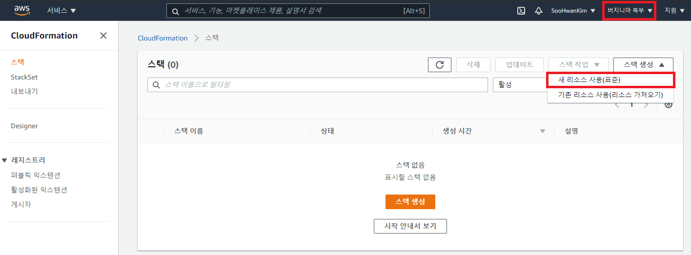
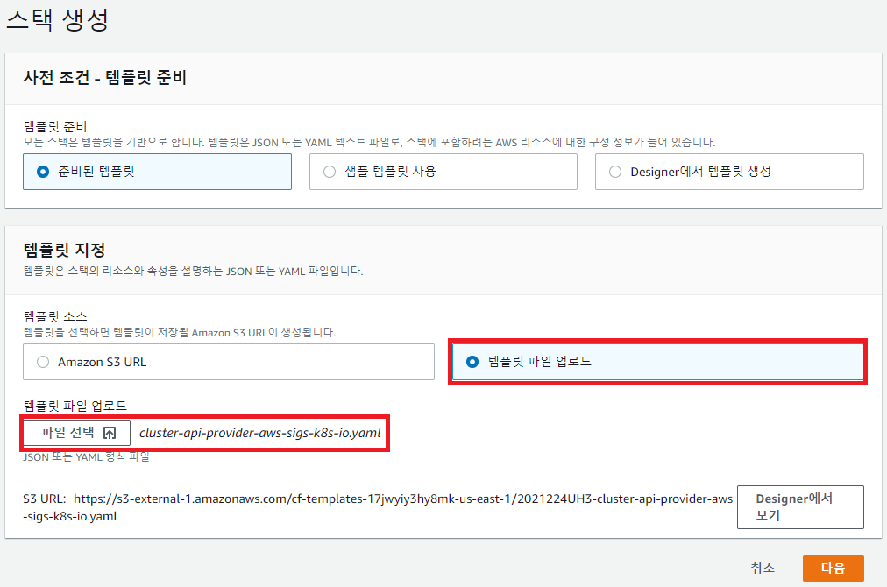
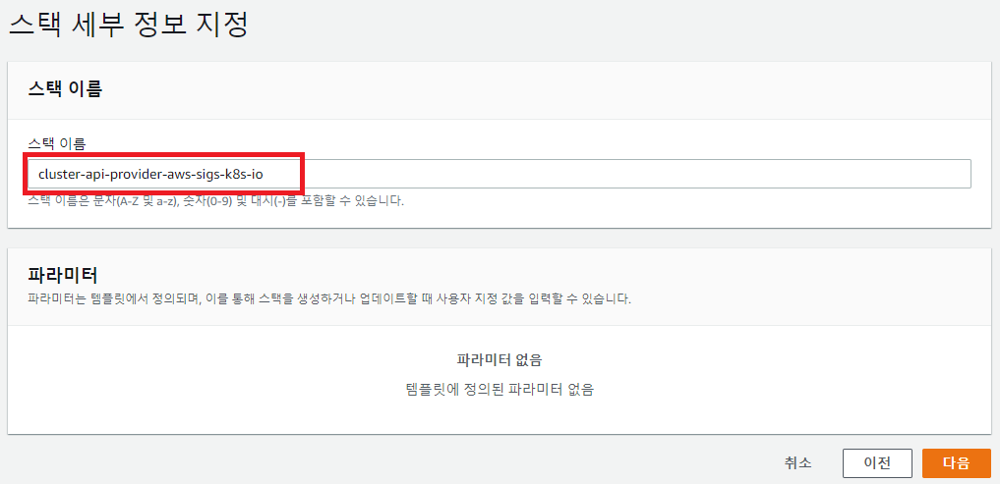
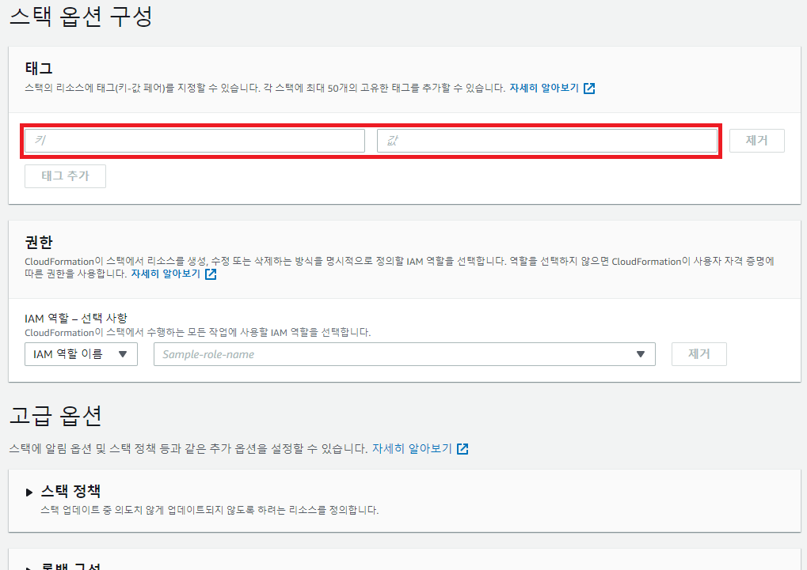
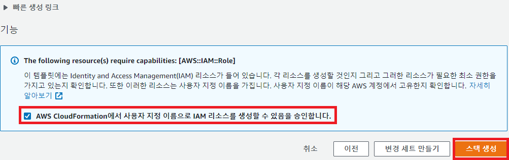
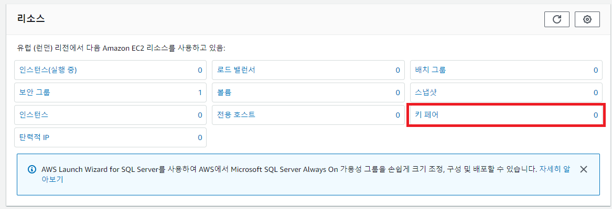

# AWS Cloudformation Stack 추가 방법
- Cloudformation Stack은 한 region에만 유일하게 존재할 수 있기 때문에 관리를 위해서 어떤 region에 생성하였는지 기억하고 있는것을 권장

1. AWS Cloudformation console에서 stack을 생성할 region을 선택하고, 스택 생성 > 새 리소스 사용(표준) 선택([AWS Cloudformation Link](https://console.aws.amazon.com/cloudformation))

 

2. 템플릿 파일 업로드를 선택하고 `manifest/capa/aws-cloud-formation.yaml`을 업로드후 "다음" 버튼 클릭

 

3. 스택 이름 입력(cluster-api-provider-aws-sigs-k8s-io)후 "다음" 버튼 클릭

 

4. 태그입력(optional)후 "다음" 버튼 클릭

 

5. 하단 체크박스 클릭후 "스택 생성" 버튼 클릭

 
 

# AWS Key pair 생성 방법
1. AWS EC2 console에서 Key pair를 생성할 region을 선택하고, 키 페어 클릭([AWS EC2 Link](https://console.aws.amazon.com/ec2/v2))

2. "키 페어 생성" 버튼 클릭

3. 키 페어 이름 입력후 "키 페어 생성" 버튼 클릭